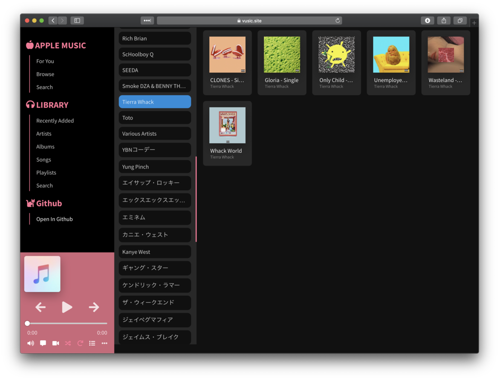

# Vusic - Apple Music Web Player

### Made with Vue, Vuex , Vue Router, (Styled with SASS). Powered by Genius, Youtube and Apple MusicKitJS SDK

# Discussions
[Hackernews (Show HN)](https://news.ycombinator.com/item?id=21928211)

[Reddit (/r/Vue)](https://www.reddit.com/r/vuejs/comments/ei6ikk/i_made_a_apple_music_web_player_in_vuejs/)

# Features 

## Library
* View all songs, albums, playlists in your library.
* Add songs to your Library.
* Search you library.

## Apple Music
* Browse currently popular songs.
* Search Apple Music catalog.
* Show recommendations by Apple (For You)
* Browse Recently played , added and most frequently played items (heavy rotation)
* like or dislike (rate) a song

## Other features
* Show music video for currently playing song (youtube)
* Show lyrics for currently playing song


# Screenshots

### Album View


### Library Artists


### Playlist View


### Music Video and Lyrics


### Library Playlists


### Options Menu


### Queue Items


# How to Build

Rename `apiKeys.example.js` to `apiKeys.js` and add all the necessary api keys

### Api keys example
```js
const keys = {
  appleMusic: {
    developerToken: 'Apple MusicKitJS API Key Goes Here',
    name: 'Vusic',
    build: 'ver1',
    version: 'ver1',
  },
  geniusAccessToken: 'Genius Access Token Goes Here',
  youtubeApiKey: 'Youtube Api Key Goes Here',
};
```

## Project setup
```
npm install
```

### Compiles and hot-reloads for development
```
npm run serve
```

### Compiles and minifies for production
```
npm run build
```

### Lints and fixes files
```
npm run lint
```

### Customize configuration
See [Configuration Reference](https://cli.vuejs.org/config/).
# Other Projects like this (inspiration for this project)

## [Musish](https://github.com/Musish/Musish)
## [apple-music-webplayer by zachomedia](https://github.com/zachomedia/apple-music-webplayer)


